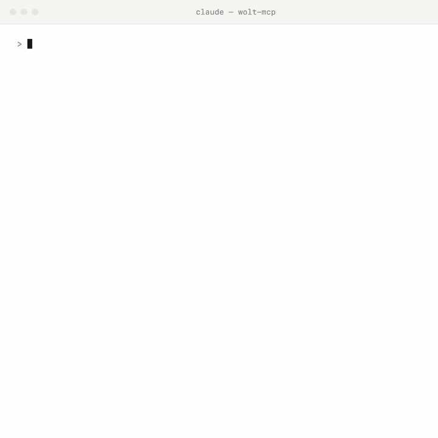

# wolt-mcp

**Use Wolt from your favorite AI tool.** An open-source MCP server that lets Claude Desktop, Claude Code, Cursor, or any MCP client search Wolt, plan a grocery cart from a recipe, browse restaurant menus, and fill your Wolt basket — you review and check out on wolt.com yourself. **Nothing is ever ordered or paid automatically.**

> "Add the ingredients for carbonara to my cart" · "Order my usual from that burger place" · "What's good and open near me right now?" · "How much will my basket cost with delivery?"

## Install

**Claude Desktop** — download the `.mcpb` bundle from [Releases](../../releases/latest) and double-click it.

**Claude Code** — `claude mcp add wolt-mcp -- npx -y wolt-mcp`

**Other MCP clients** — stdio config `{ "command": "npx", "args": ["-y", "wolt-mcp"] }`, or clone this repo, `cd mcp && npm install`, and point your client at `mcp/server.mjs`.

Requires Node 22+.

Then in chat: *"Connect my Wolt account"* (a browser window opens in a separate profile; log in) → *"use my saved Wolt address"* → shop. Login needs a Chromium-based browser (Chrome, Edge, Brave, Chromium); Firefox/Safari users paste a token instead.

Full walkthrough in [docs/setup.md](docs/setup.md); internals in [docs/architecture.md](docs/architecture.md).

## What it does

29 tools across:

- **Find** — grocery products, restaurant dishes, venues, a filtered "what's good and open near me" ranking, the discovery feed, and item lookup by name or wolt.com URL.
- **Browse** — venue details and opening hours, category trees, full menus (including large grocery catalogs), and dish option groups with required/conditional choices.
- **Cart** — recipe → single-store plan, merge-safe basket writes with dish options, line editing, and a checkout preview showing your real total including delivery and fees.
- **Account** — saved addresses, order history (so "order my usual" works), favorites, payment methods, geocoding.

## How it works

Wolt's own web-client APIs, spoken politely: search is unauthenticated; account actions use a refresh-token chain harvested once from your logged-in browser session and auto-renewed forever. Tokens live only on your machine (`~/.wolt-mcp/`, mode 600) and are sent nowhere except wolt.com.

Every tool above has been exercised against a live account — token refresh, basket writes verified to persist server-side, dish options, checkout totals, order history.

## Status & disclaimers

Early but working — **unofficial**, built on private consumer APIs that can change without notice. Personal use; payment is never automated. MIT license.

**Automating access may violate Wolt's Terms of Service.** You run this against your own account, at your own risk, and Wolt could restrict or block that account. This project never places or pays for an order, and backs off when Wolt asks it to — but that is a design choice, not permission.

Your credentials go nowhere but wolt.com. The one other outbound call is geocoding: if you ask it to look up an address by name (`resolve_address`), that address text — and nothing else, no token, no account data — is sent to OpenStreetMap's Nominatim service. Everything else talks only to wolt.com.

Not affiliated with, endorsed by, or sponsored by Wolt. Wolt is a trademark of Wolt Enterprises Oy.
